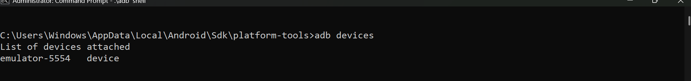
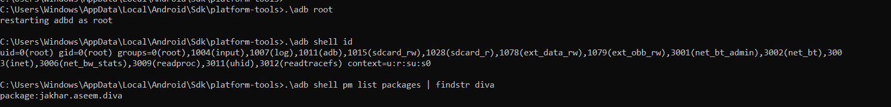
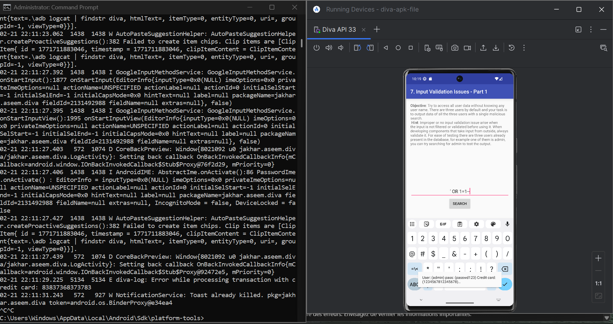
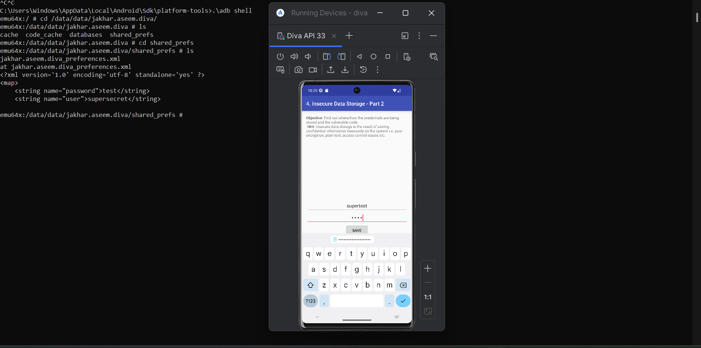
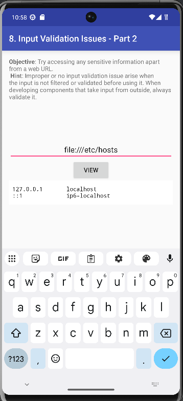

# Lab 2 : Rooting & Sécurité Android

> Comprendre le rooting et tester les vulnérabilités OWASP sur une app Android

---

## Étape 1 : Fiche périmètre

| Champ | Valeur |
|-------|--------|
| **Support** | AVD / Device labo |
| **Objectif** | Rooting et impacts sur les contrôles d'intégrité |
| **Données** | Fictives |
| **Réseau** | Test |

---

## Étape 2 : Démarrer un AVD propre

- Android Studio → Device Manager → **Start** (ou créer un AVD avec API 29+)
- Vérifier : écran d'accueil Android, **aucun compte personnel**
- `adb devices` doit détecter l'émulateur

> Préférer les versions récentes (API 29+) pour observer les mécanismes de sécurité modernes.

---

## Étape 3 : Rooter l'AVD

```bash
adb devices
adb root
adb remount
adb shell id   # → uid=0(root)
```

**Vérifications :**
```bash
adb shell getprop ro.boot.verifiedbootstate   # green/orange/yellow
adb shell "su -c id"                          # Tester su
```

**Option si adb root échoue :** `adb disable-verity` → `adb reboot` → `adb remount`




---

## Étape 4 : Installer et lancer l'app

```bash
adb install app-debug.apk
```

Ou via Android Studio : **Run**. Vérifier que l'app s'ouvre et noter la version.

---

## Étape 5 : Scénarios de test

### Scénario 1 : SQL Injection

Test d'injection SQL dans les champs de saisie de l'app.



---

### Scénario 2 : Insecure Data Storage

Vérification du stockage des données sensibles (SharedPreferences, fichiers) avec accès root.



---

### Scénario 3 : Input Validation (URL)

Test de validation des URLs et failles d'input (XXE, injection via URLs).



---

## Étape 6 : Android Security (résumé)

1. **Sandboxing** : Chaque app est isolée des autres
2. **Modèle de permissions** : Contrôle d'accès aux ressources sensibles
3. **Intégrité système** : Protection contre les modifications non autorisées

---

## Étape 7 : Verified Boot

**Objectif** : Garantir que le système qui démarre est celui prévu par le fabricant, sans modification malveillante.

**Chain of trust** : Chaque composant vérifie l'authenticité du suivant avant de lui faire confiance.

| Couleur | Signification |
|---------|---------------|
| Green | Système vérifié et intègre |
| Yellow/Orange | Système modifié |
| Red | Intégrité compromise |

---

## Étape 8 : AVB (Android Verified Boot)

AVB = version 2.0 de Verified Boot. Ajoute vérification d'intégrité moderne + **protection anti-rollback** (empêche d'installer d'anciennes versions vulnérables).

---

## Étape 9 : Définition du Rooting

- **Root** = privilèges super-utilisateur. Modifie les protections et la confiance du système.
- Utile en labo pour observer comportements à bas niveau, tester le stockage face à un attaquant privilégié.
- Risqué → isolement + traçabilité + reset. **Labo autorisé uniquement.**

---

## Étape 10 : Matrice de risques (8 risques)

1. Intégrité non garantie → conclusions biaisées
2. Surface d'attaque accrue → exposition aux menaces
3. Données sensibles exposées → violation confidentialité
4. Instabilité système → tests non reproductibles
5. Mélange comptes perso/test → fuite d'informations
6. Mauvais nettoyage → persistance de données sensibles
7. Réseau non isolé → effets sur systèmes externes
8. Traçabilité insuffisante → impossible d'auditer

---

## Étape 11 : Mesures défensives (8 mesures)

1. Réseau isolé
2. Données fictives uniquement
3. Device/AVD dédié aux tests
4. Snapshots ou wipe en fin de séance
5. Journal de configuration détaillé
6. Aucun compte personnel
7. Contrôle strict des APK installées
8. Horodatage + captures pour traçabilité

---

## Étape 12 : OWASP MASVS (2 exigences)

- **STORAGE-1** : Données sensibles stockées de façon sécurisée (chiffrement approprié)
- **NETWORK-1** : TLS avec configuration correcte et vérification des certificats

---

## Étape 13 : OWASP MASTG (2 idées de tests)

- Examiner `/data/data/[package]/shared_prefs/` pour données sensibles en clair
- Analyser `adb logcat` pour détecter fuites d'informations pendant l'exécution

---

## Étape 14 : Commandes de référence

```bash
adb devices
adb root
adb remount
adb shell id
adb shell getprop ro.boot.veritymode
adb shell getprop ro.boot.vbmeta.device_state
adb shell "su -c id"
```

**Journalisation :** `adb logcat -d | tail -n 200 > logcat_root_check.txt`

---

## Étape 15 : Fiche environnement (traçabilité)

| Champ | Valeur |
|-------|--------|
| Date / Auteur | |
| Support | AVD / Device labo |
| Version Android / API | |
| App + version | |
| Scénario 1-2-3 | Observations factuelles |
| Limites | |
| Reset effectué | Oui/Non + preuve |

---

## Étape 16 : Remise à zéro (obligatoire)

**AVD :** Android Studio → Device Manager → Wipe Data  
Ou : `adb emu avd stop` puis `adb emu avd wipe-data`

**Device labo :** Paramètres → Réinitialisation usine. Preuve : assistant initial visible.
